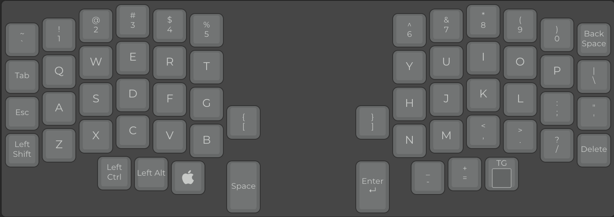
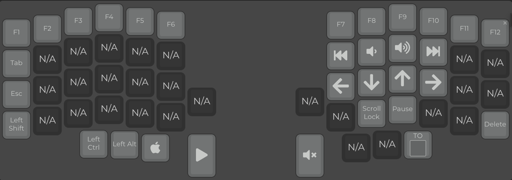

# Lily58 Minimal Code Layout

This layout aims to balance muscle memory from a typical QWERTY layout while
having all the keys used for software development at the first layer only.

## Base Layer

## Lower Layer

## Features:

- **Two-Layer Design:**
  - **Base Layer:** A QWERTY-like layout optimized for coding, providing easy
    access to common programming symbols on the primary layer.
  - **Lower Layer:** Accessed via a toggle key, this layer includes:
    - Function keys (F1-F12).
    - Media control keys (Play, Mute, Volume, Next/Previous Track).
    - Arrow keys arranged for intuitive navigation (VIM-like).
    - Brightness control keys.
- **Performance Focused:**
  - High matrix scan rate (improved from the default keymap's 1353 Hz to 1572
    Hz).
  - Achieved by disabling unused QMK core features (Mouse Keys, Locking Support,
    Space Cadet, Grave Escape, Magic Commands, general Command Interface) and
    optional features (Action Tapping, One-Shot modifiers/layers, Macros,
    complex Functions).
  - Link Time Optimization (LTO) enabled to reduce firmware size and improve
    speed.
  - Uses a minimal `printf` implementation.
- **OLED Display Optimization:**
  - **Smart Updates:** The OLED display only updates when the layer changes,
    significantly improving firmware performance by avoiding unnecessary display
    writes.
  - **Performance Impact:** OLED writes are expensive operations that can impact
    matrix scan rate. By only updating when needed, we maintain high performance
    while keeping the display informative.
  - Shows the keymap name ("{ minimal-code }") and the currently active layer.
  - Display rotates 180 degrees on the master half for correct orientation.
  - Features a fade-out effect and a 60-second timeout.
- **Key Input & Reliability:**
  - **N-Key Rollover (NKRO):** Enabled by default, ensuring all simultaneous key
    presses are registered.
  - **Debounce Algorithm:** Symmetric Eager Per Key (`sym_eager_pk`) with a 5ms
    debounce time for responsive and accurate key presses.
  - **USB Polling:** Set to 1ms for high-frequency updates and reduced input
    latency.
- **Split Keyboard Enhancements:**
  - Right half configured as the master by default.
  - Layer state is synchronized between the two halves.
- **Security:**
  - Keylogger functionality is explicitly disabled.
