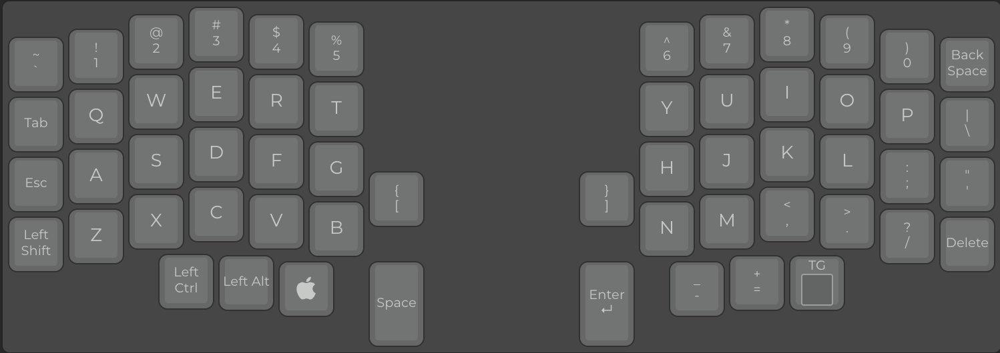
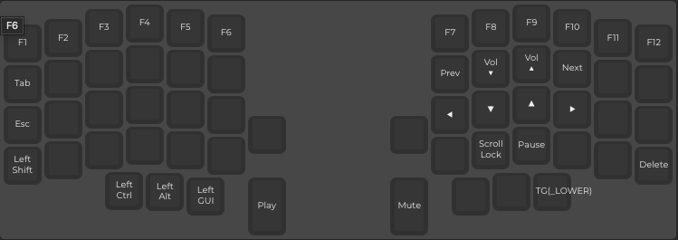

# QMK Firmware Fork - Lily58 Minimal Code Layout

[](https://github.com/kata0510/Lily58)
[](https://qmk.fm/)

This is a personal fork of [QMK Firmware](https://github.com/qmk/qmk_firmware) containing my custom **minimal-code** keymap for the Lily58 split keyboard.

## My Keymap

A performance-optimized, two-layer layout designed for software developers.

| Layer | Description |
|-------|-------------|
|  | **Base:** QWERTY with all coding symbols accessible |
|  | **Lower:** F-keys, media, VIM-style arrows |

### Highlights

- 🚀 **~1572 Hz** matrix scan rate (vs ~1353 Hz default)
- ⌨️ **1ms USB polling** for minimal input latency
- 📺 **Smart OLED** - only updates on layer change
- 🔒 **NKRO enabled** by default

👉 **[Full documentation](keyboards/lily58/keymaps/minimal-code/README.md)**

## Quick Start

```bash
# Clone this repo
git clone https://github.com/le4ker/qmk-firmware.git
cd qmk-firmware

# Set up QMK
qmk setup

# Build and flash
cd keyboards/lily58/keymaps/minimal-code
make flash
```

## Upstream

This fork is based on [qmk/qmk_firmware](https://github.com/qmk/qmk_firmware). To sync with upstream:

```bash
git remote add upstream https://github.com/qmk/qmk_firmware.git
git fetch upstream
git merge upstream/master
```

## License

GPL-2.0-or-later (see [LICENSE](LICENSE))
